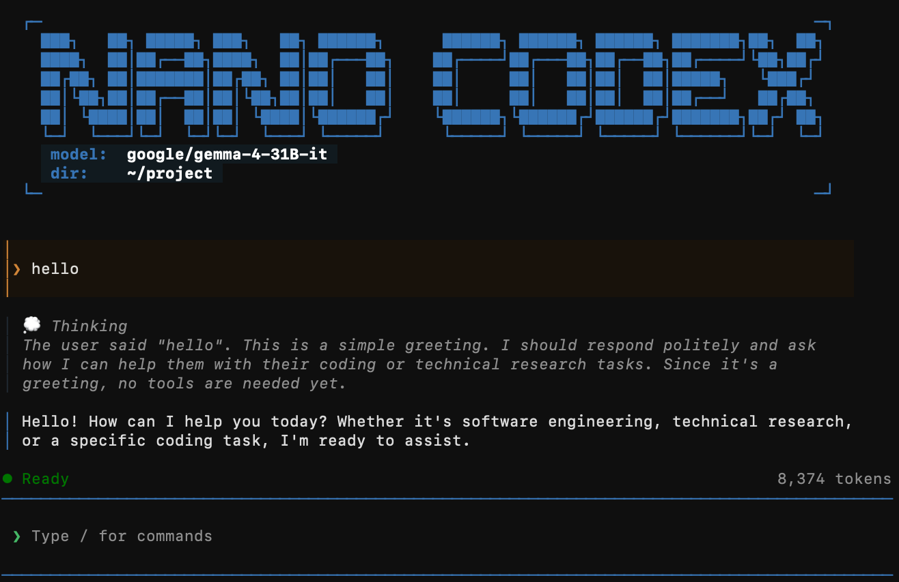

<div align="center">
  <h1>Nano-Codex</h1>
  <p><i>A lightweight Codex-style CLI for customizable agents, tools, and context control.</i></p>
</div>

<p align="center">
  <a href="README.md">English</a> |
  <a href="README.zh.md">简体中文</a>
</p>

<div align="center">

  [](https://www.python.org/)
  [](LICENSE)
  [](https://github.com/microsoft/agent-framework)

</div>

<div align="center">

  <a href="#key-features">Key Features</a> &nbsp;•&nbsp;
  <a href="#runtime-overview">Runtime Overview</a> &nbsp;•&nbsp;
  <a href="#project-structure">Project Structure</a> &nbsp;•&nbsp;
  <a href="#installation">Installation</a> &nbsp;•&nbsp;
  <a href="#quick-start">Quick Start</a> &nbsp;•&nbsp;
  <a href="#built-in-features">Built-in Features</a> &nbsp;•&nbsp;
  <a href="#extension-docs">Extension Docs</a>

</div>

<div align="center">
  
</div>

Nano-Codex is a lightweight, highly extensible coding CLI built on [Microsoft Agent Framework](https://github.com/microsoft/agent-framework). It offers Codex-style tooling with configurable agents, controllable context, and inspectable execution.

## Key Features

### Built-in Tools
Built-in tools cover common coding, shell, web, media, planning, skill, and subagent workflows, with MCP support for project-specific extensions.

### Context Engineering
Context can be shaped through agent, chat, and function middleware, with both automatic compaction and manual `/compact` for long sessions.

### Agent Customization
Each agent and subagent can be configured with its own tools, skills, and chat completion options such as `enable_thinking`.

### Observable UI
Console and TUI output keep the agent loop visible by rendering thinking, tool calls, subagent activity, compaction, and session events in a structured way.

## Runtime Overview

Nano-Codex uses a ReAct-style agent loop for coding workflows, with tools, middleware, and UI observability built around that core execution pattern.

### System Prompt Assembly

The system prompt is assembled from three main inputs:

- the instruction body in `agent.md`
- a runtime environment block that includes the working directory, platform, and current date
- the skills declared in the `agent.md` YAML frontmatter and loaded from `skills_dir`

The initial system prompt is not compacted away and remains part of the active context throughout the session.

### Middleware Layers

Nano-Codex uses three middleware types, each attached to a different level of the runtime:

- `Agent middleware` pre-processes and post-processes one full agent loop. It is the right place to rewrite the message list, adjust run-level options, or add reminders that should affect the whole loop.
- `Chat middleware` pre-processes and post-processes each LLM request/response inside the loop. It is useful when you want to transform what reaches the model or reshape the model response before later stages consume it.
- `Function middleware` pre-processes and post-processes each individual tool invocation. It can inspect validated tool arguments, attach metadata, or rewrite tool results before they are returned to the loop.

These layers serve different context-engineering tasks at the agent-loop, LLM-call, and tool-invocation levels.

## Project Structure

```text
nano-codex/
├── README.md
├── README.zh.md                    # Simplified Chinese README
├── agent.md                         # Main agent definition (YAML frontmatter + instructions)
├── launcher.py                      # CLI entrypoint
├── requirements.txt                 # Primary pip dependency list
├── nano_codex.yaml                  # Default runtime configuration entrypoint
├── configs/
│   ├── agents/                      # Subagent definitions loaded at runtime
│   ├── mcp_config.json              # MCP server configuration
│   ├── model_config.json            # Model endpoint and alias configuration
│   └── skills/                      # Local skill definitions and references
├── docs/                            # Documentation assets and extension guides
└── src/
    ├── agent_framework_patch/       # Framework patch layer for metadata, history, and chat client behavior
    │   ├── function_invocation_layer.py      # Patched function-invocation loop integration
    │   ├── history_compaction_runtime.py     # Compact-aware session history runtime
    │   ├── openai_chat_completion_client.py  # Patched chat completion client
    │   └── tool_invocation.py                # Tool-call metadata propagation patch
    ├── core/                        # Core runtime assembly and workflow orchestration
    │   ├── interactive_workflow.py          # Interactive workflow around the agent loop
    │   └── nano_codex.py                    # Main Nano-Codex agent construction
    ├── middlewares/                 # Middleware registry and built-in middleware implementations
    │   ├── agent_middlewares.py            # Agent-loop middleware implementations
    │   ├── chat_middlewares.py             # LLM-call middleware implementations
    │   ├── function_middlewares.py         # Tool-invocation middleware implementations
    │   └── middleware_registry.py          # Middleware registration and loading
    ├── toolkit/                     # Built-in tool packages and toolkit loading
    │   ├── bash/                           # Shell execution tools
    │   ├── file_operation/                 # File, image, and video tools
    │   ├── planning/                       # Todo and dev-log tools
    │   ├── skilling/                       # Skill-loading tools
    │   ├── subagent/                       # Subagent delegation tools
    │   ├── web_operation/                  # Web search and fetch tools
    │   ├── tool_loader.py                  # Toolkit registration and MCP loading
    │   └── tool_support.py                 # Shared toolkit runtime context and helpers
    ├── ui/                          # Shared console and interactive UI layers
    │   ├── compaction.py                   # UI formatting helpers for compaction output
    │   ├── console_display.py              # Rich console renderer
    │   ├── events.py                       # Shared UI event definitions
    │   ├── presenters.py                   # Framework-to-UI event presenters
    │   ├── protocol.py                     # UI runtime interfaces
    │   └── tui/                            # Textual app, slash commands, transcript state, and widgets
    └── utils/                       # Prompt assembly, model config, history IO, and compaction helpers
        ├── auto_compact.py                 # Automatic and manual compaction logic
        ├── history_io.py                   # Session persistence helpers
        ├── markdown_parser.py              # Markdown + YAML frontmatter parsing
        ├── model_client.py                 # Model config resolution and client creation
        ├── plugin_discovery.py             # Skill discovery helpers
        └── prompt_assembler.py             # System prompt assembly
```

## Installation

Python 3.10+ is supported.

```bash
git clone https://github.com/Mr-Righter/nano-codex.git
cd nano-codex
uv venv
source .venv/bin/activate
uv pip install -r requirements.txt
```

## Quick Start

### 1. Configure Model Access

Edit `configs/model_config.json` and point it at an OpenAI-compatible chat completion endpoint.

Example:

```json
{
  "global": {
    "base_url": "https://your-openai-compatible-endpoint/v1",
    "api_key": "your-global-api-key"
  },
  "models": {
    "gpt-5.4": {
      "model_id": "gpt-5.4"
    },
    "gemma-4-31B": {
      "model_id": "google/gemma-4-31B-it",
      "base_url": "https://your-gemma-endpoint/v1",
      "api_key": "your-gemma-api-key"
    }
  }
}
```

The `model` field in `nano_codex.yaml`, `agent.md`, or CLI arguments should match one key under `models`. When a model entry defines its own `base_url` or `api_key`, those values override `global`.

### 2. Configure Runtime Inputs

`nano_codex.yaml` defines the default runtime behavior. A practical starting point looks like this:

```yaml
is_interactive: true
model: gpt-5.4
work_dir: /absolute/path/to/workdir
agent_loop_max_iterations: 40

agent_config_path: ./agent.md
model_config_path: configs/model_config.json
mcp_config_path: configs/mcp_config.json
skills_dir: configs/skills
agents_dir: configs/agents

middlewares:
  - "user_message_reminder"
  - "logging_response"
  - "move_tool_media_to_user_message"
  - "tool_result_reminder"
  - "logging_function_result"

auto_save_history: true
auto_compact_enabled: true
auto_compact_max_tokens: 200000
auto_compact_keep_last_groups: 0
```

Notes:

- For the full launcher config reference, run `python launcher.py -h`.

### 3. Configure `agent.md`

`agent.md` uses YAML frontmatter between `---` markers plus Markdown instructions. The frontmatter controls runtime-facing fields such as model selection, tool exposure, preloaded skills, and default chat completion options, while the Markdown body provides the instructions the agent follows at runtime.

Example:

```markdown
---
name: Nano-Codex
description: General-purpose engineering agent.
model: gpt-5.4
tools: [read, write, edit, glob, grep, bash, web_search, use_skill, solve_task_with_subagent]
skills: [agent-browser]
default_options:
  reasoning_effort: high
---

# Nano-Codex

Your instruction body goes here.
```

Common frontmatter fields:

- `name`: agent display name
- `description`: short description used by the runtime and subagent tooling
- `model`: default model alias from `configs/model_config.json`
- `tools`: tool names exposed to this agent
- `mcp_service`: MCP service names loaded from `configs/mcp_config.json`
- `skills`: skills preloaded into the system prompt
- `hidden_skills`: skills that cannot be invoked by this agent through `use_skill`
- `default_options`: default chat completion options such as `enable_thinking`

Subagents use the same `YAML frontmatter + instructions` format under `configs/agents/`.

### 4. Run Nano-Codex

Non-interactive single-task mode:

```bash
python launcher.py --config nano_codex.yaml --is_interactive false --task "Inspect the repo and write a summary"
```

Interactive TUI mode:

```bash
python launcher.py --is_interactive true
```

You can also override config values directly:

```bash
python launcher.py --is_interactive true --work_dir /absolute/path/to/workdir
```

Use `nano_codex_debug.log` for startup and runtime debugging.

## Built-in Features

### Toolkit

Nano-Codex loads the built-in toolkit from `src/toolkit/`, then filters the final tool surface through the active agent's `tools:` frontmatter in `agent.md` or a subagent definition.

| Tool | Group | Purpose |
| --- | --- | --- |
| `read` | File | Read file contents into the current context. |
| `write` | File | Create or overwrite files. |
| `edit` | File | Modify existing files. |
| `glob` | File | Find files by path pattern. |
| `grep` | File | Search file contents by pattern. |
| `bash` | Shell | Run commands in the persistent shell session. |
| `bash_output` | Shell | Read new output from a background bash process. |
| `kill_bash` | Shell | Stop a background bash process. |
| `view_image` | Media | Read image content directly into the current context, which is useful for tasks such as frontend page generation. |
| `analyze_image` | Media | Use the model to analyze an image and return textual output, which is better suited for general image analysis tasks. |
| `view_video` | Media | Read video content into the current context by sampling frames. `video_frame_fps` and `video_max_frames` control the frame extraction. |
| `analyze_video` | Media | Use the model to analyze sampled video frames and return textual output. `video_frame_fps` and `video_max_frames` control the frame extraction. |
| `write_todos` | Planning | Create or update the structured todo list. |
| `write_dev_log` | Planning | Persist durable debugging or execution notes. |
| `web_search` | Web | Search the web and return summarized results. |
| `web_fetch` | Web | Fetch and extract content from a specific web page. |
| `use_skill` | Skill | Load one local skill into the current run. |
| `solve_task_with_subagent` | Subagent | Delegate a bounded task to a configured subagent. |

### Middlewares

| Middleware | Layer | Purpose |
| --- | --- | --- |
| `user_message_reminder` | Agent | Pre-processes the current agent loop by inserting a reminder next to the latest user message. |
| `logging_response` | Chat | Post-processes chat responses into assistant events for the console and TUI layers. |
| `move_tool_media_to_user_message` | Chat | Pre-processes the next model input by rewriting tool-returned media into follow-up user messages. |
| `strip_reasoning` | Chat | Pre-processes chat requests by removing reasoning items before they are sent downstream. |
| `tool_result_reminder` | Function | Post-processes selected tool results by appending follow-up reminders. |
| `logging_function_result` | Function | Pre-processes and post-processes tool execution into structured UI events. |

See [docs/extensions/middlewares.md](docs/extensions/middlewares.md) for execution order, data flow, and extension examples.

### Slash Commands

| Command | Purpose |
| --- | --- |
| `/compact` | Force one manual compaction pass for the active session. |
| `/clear` | Clear non-system history while keeping the current system context. |
| `/model` | Open the interactive model picker. |
| `/exit` | Quit Nano-Codex. |

### Context Management

#### Compaction

Auto-compact is driven by the `auto_compact_*` settings in `nano_codex.yaml`. When the last observed model-call token count crosses `auto_compact_max_tokens`, Nano-Codex summarizes older visible message groups into a continuation summary and marks the summarized messages as excluded instead of simply dropping them. `auto_compact_keep_last_groups` keeps the most recent groups visible, and `/compact` uses the same summarization path for manual compaction.

#### Session Recovery

Interactive session history is persisted as a serialized `AgentSession` JSON file. By default, Nano-Codex saves and restores from `{work_dir}/.sessions/session_history.json`; if `history_file` is set, that path becomes the explicit restore/save target. This makes session recovery a built-in persistence mechanism rather than a slash-command feature.

## Skills and Subagents

### Skills

By default, Nano-Codex discovers skills from `configs/skills/*/SKILL.md`. To use a different root directory, change `skills_dir` in `nano_codex.yaml` or pass `--skills_dir` on the CLI.

Each skill is a directory-based instruction pack. `SKILL.md` uses YAML frontmatter between `---` markers plus Markdown instructions. The frontmatter tells Nano-Codex when and how the skill should be used, and the Markdown body provides the instructions followed when the skill is invoked.

Example:

```markdown
---
name: agent-browser
description: Browser automation CLI for navigation, screenshots, and DOM interaction.
invoke_when: Task requires browser interaction or page inspection.
---

# agent-browser

Use this skill when the task depends on operating a browser or inspecting a live page.
```

Reference structure:

```text
configs/skills/
└── agent-browser/
    ├── SKILL.md
    └── references/
        └── commands.md
```

### Subagents

Subagents use the same `YAML frontmatter + instructions` format as `agent.md`. By default, Nano-Codex discovers them from `configs/agents/*.md`. To use a different directory, change `agents_dir` in `nano_codex.yaml` or pass `--agents_dir` on the CLI.

## Extension Docs

- [Custom Tools](docs/extensions/custom-tools.md)
- [Middlewares](docs/extensions/middlewares.md)
- [Slash Commands](docs/extensions/slash-commands.md)

## Next Steps

- `More Slash Commands`: add more built-in slash commands such as `/plan` and `/review`.
- `Tool Modes`: introduce tool-mode controls such as ask-before-edit and edit-automatically.
- `Interaction Improvements`: improve user interaction with features such as interrupting an active agent loop and tools like `ask_user_question`.

## License

MIT License. See [LICENSE](LICENSE) for details.
