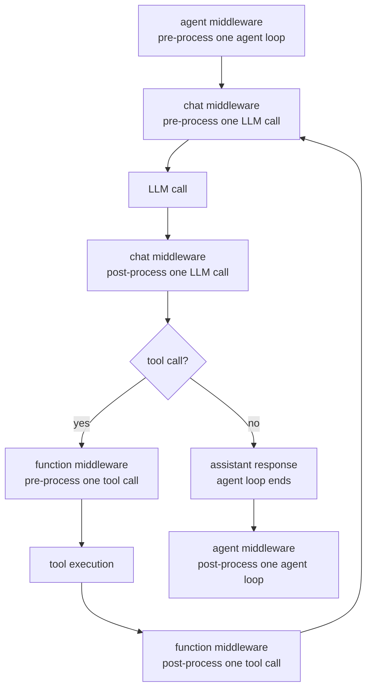
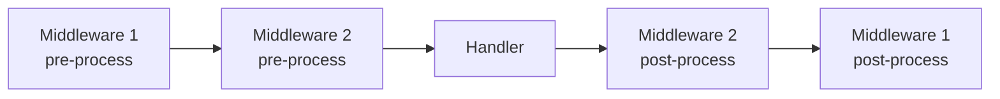

# Middlewares

Nano-Codex uses the three-layer [Agent Framework middleware model](https://learn.microsoft.com/en-us/agent-framework/agents/middleware/?pivots=programming-language-python). Middleware is registered locally, enabled by name in `nano_codex.yaml`, and then applied at the agent, chat, or function layer.

## Middleware Layers

| Layer | Context | Runs Around | Common Use |
| --- | --- | --- | --- |
| Agent | `AgentContext` | One full agent loop | Pre-process or post-process top-level messages, tools, and run options |
| Chat | `ChatContext` | Each LLM call | Pre-process request messages or post-process model responses |
| Function | `FunctionInvocationContext` | Each tool invocation | Pre-process validated arguments or post-process tool results |

All three layers can run pre-process logic before `await call_next()` and post-process logic after it. Once `call_next()` returns, `context.result` holds the downstream result and can still be observed or replaced.

## Middleware Timing

The official Agent Framework guides describe middleware as wrappers around downstream execution. Nano-Codex uses that same model at three different scopes:

- [Agent Middleware](https://learn.microsoft.com/en-us/agent-framework/agents/middleware/?pivots=programming-language-python)
- [Adding Middleware to Agents](https://learn.microsoft.com/en-us/agent-framework/agents/middleware/defining-middleware?pivots=programming-language-python)



Agent middleware pre-processes and post-processes one full agent loop. Chat middleware pre-processes and post-processes each LLM request/response inside that loop. Function middleware pre-processes and post-processes each individual tool invocation. In one agent loop, chat middleware may run multiple times and function middleware may run multiple times.

## How Middleware Loading Works

1. Built-in middleware modules are imported through `src/middlewares/__init__.py`, which triggers registration.
2. `@register_middleware("name")` stores a middleware function, class, or instance in the registry.
3. `load_middlewares([...])` resolves the configured names.
4. `configure_middlewares(..., ui_sink=...)` creates per-agent middleware instances and injects `ui_sink` when supported.
5. The runtime groups the configured entries by middleware type and applies each group at its own layer.

## Ordering and Composition

- Order is preserved within the same layer.
- The first configured middleware in a layer is the outermost wrapper.
- Configured names do not form one single global chain. They are split by type first, then ordered within each type.

Within the same middleware type, execution follows a normal wrapper pattern:



The configured order in `nano_codex.yaml` decides this nesting. The first middleware in one layer pre-processes first and post-processes last.

## Minimal Examples

Each example below shows both pre-process logic before `await call_next()` and post-process logic after it.

### Agent Middleware

```python
from collections.abc import Awaitable, Callable

from agent_framework import AgentContext, Content, Message, agent_middleware

from src.middlewares.middleware_registry import register_middleware


@register_middleware("inject_rule")
@agent_middleware
async def inject_rule(
    context: AgentContext,
    call_next: Callable[[], Awaitable[None]],
) -> None:
    context.metadata["original_message_count"] = len(context.messages)
    context.messages = [
        Message("system", [Content.from_text("Extra runtime rule.")]),
        *context.messages,
    ]
    await call_next()
    if context.result is not None:
        context.metadata["result_ready"] = True
```

### Chat Middleware

```python
from collections.abc import Awaitable, Callable

from agent_framework import ChatContext, chat_middleware

from src.middlewares.middleware_registry import register_middleware


@register_middleware("log_prompt_size")
@chat_middleware
async def log_prompt_size(
    context: ChatContext,
    call_next: Callable[[], Awaitable[None]],
) -> None:
    print(f"Sending {len(context.messages)} messages to the model")
    await call_next()
    if context.result is not None:
        print(f"Received {len(context.result.messages)} response message(s)")
```

### Function Middleware

```python
from collections.abc import Awaitable, Callable

from agent_framework import Content, FunctionInvocationContext, FunctionMiddleware

from src.middlewares.middleware_registry import register_middleware


@register_middleware("append_tool_footer")
class AppendToolFooter(FunctionMiddleware):
    async def process(
        self,
        context: FunctionInvocationContext,
        call_next: Callable[[], Awaitable[None]],
    ) -> None:
        tool_name = context.function.name
        print(f"Running tool: {tool_name}")
        await call_next()
        context.result.append(Content.from_text(f"Processed by {tool_name}"))
```

## Project Pattern

- Use decorator-based middleware for simple stateless behavior.
- Use middleware classes when you need state, cloning, or injected `ui_sink`.
- Put run-wide prompt shaping in agent middleware.
- Put per-request message shaping in chat middleware.
- Put tool presentation and post-tool reminders in function middleware.
